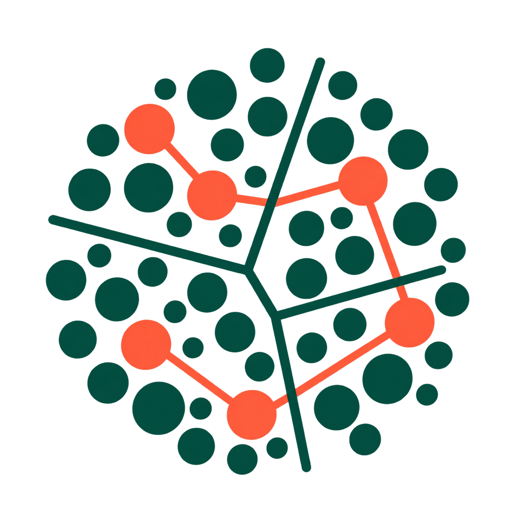
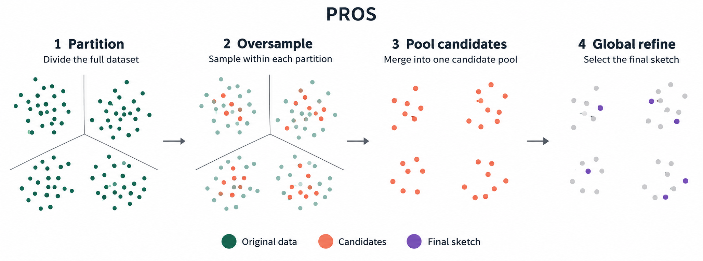

<h1 align="center">
  
  PROS
</h1>

<p align="center">
  <strong>Partitioned and Refined Oversampling Sketches</strong><br>
  Partition. Sample. Refine.
</p>

<p align="center">
  <a href="https://pypi.org/project/pros-sketch/"></a>
  <a href="#installation"></a>
  <a href="LICENSE"></a>
</p>

<p align="center">
  
</p>

PROS selects a small,
diversity-preserving subset of rows from a large real-valued coordinate matrix.
It builds an oversampled candidate pool within partitions and performs one
global refinement pass over that pool. The returned subset is represented by
indices into the original matrix.

The package is domain-agnostic. It can be used with reduced single-cell
embeddings, as well as other feature matrices where Euclidean distance is a
meaningful geometry.

## Installation

PROS requires Python 3.10 or newer. Install from PyPI:

```bash
pip install pros-sketch
```

The distribution name is `pros-sketch`; the Python import remains `pros`.
To install a local checkout for development:

```bash
python -m pip install -e .
```

Optional AnnData support:

```bash
python -m pip install -e ".[adata]"
```

For testing and linting:

```bash
python -m pip install -e ".[dev]"
```

## Quick start

```python
import numpy as np
from pros import sketch

X = np.random.default_rng(0).random((5_000, 50))
result = sketch(X, n=500, seed=0)

indices = result.indices
X_sketch = X[indices]
print(result.timings)
```

`result.indices` is a sorted, unique `int64` array of length `n`. By default,
PROS uses k-means partitioning, water-filling allocation, an oversampling ratio
of `r=10.0`, and global farthest-first refinement. Pass an explicit `seed` to
make a stochastic configuration reproducible.

To discover the available knobs from Python, use the built-in help tools and
the package option summary:

```python
import inspect
import pros

help(pros.sketch)
print(inspect.signature(pros.sketch))

pros.options()
pros.options("partitioner")
```

## Certification

Set `certify=True` to compute the final covering radius, the candidate-pool
radius, and bounds derived from a full-data farthest-first traversal:

```python
result = sketch(X, n=500, seed=0, certify=True)

print(result.radius)       # R(X, S): final covering radius
print(result.rho)          # R(X, P): candidate-pool covering radius
print(result.opt_lower)    # lower bound on the optimal n-centre radius
print(result.ratio_upper)  # upper bound on R(X, S) / OPT_n(X)
```

Certification performs additional full-data work and is not included in
`result.timings["total"]`. Degenerate data may have `opt_lower == 0`; in that
case a finite approximation-ratio bound is not defined.

For an existing set of indices, use `pros.certificate`. `pros.opt_bounds`,
`pros.estimate_opt_scale`, and `pros.choose_r` are available for certificate
and oversampling-ratio workflows.

## AnnData

```python
from pros import sketch_adata

result = sketch_adata(adata, n=5_000, use_rep="X_pca", seed=0)
subset = adata[result.indices].copy()
```

`sketch_adata` also accepts an `.h5ad` path and reads it in backed mode before
extracting the requested representation.

## Configuration

```python
result = sketch(
    X,
    n=1_000,
    partitioner="kmeans",
    n_blocks="auto",
    allocator="water_filling",
    r=10.0,
    selector="fft",
    refiner="fft",
    seed=0,
)
```

The `partitioner`, within-partition `selector`, `allocator`, and global
`refiner` are modular. Run `pros.options()` to print every configurable
category, or pass a category such as `pros.options("allocator")` to focus on
one family. See [`docs/configuration.md`](docs/configuration.md) for the
supported values and [`docs/theory.md`](docs/theory.md) for the covering
objective and certificate definitions.

## Repository layout

- `pros/`: installable library code.
- `tests/`: automated package tests.
- `examples/`: small runnable examples using synthetic data in `data/`.
- `test_para/`: standalone parameter experiments and their generated outputs;
  this reproduction material is intentionally not packaged with the library.
- `docs/`: MkDocs source pages.

Run the examples from the repository root after installation:

```bash
python examples/01_basic_numpy.py
python examples/03_certification.py
```

## Citation

See [`CITATION.cff`](CITATION.cff) for software citation metadata.

## License

PROS is distributed under the [MIT License](LICENSE).

## Validated behavior and limits

- Water-filling is fused with FFT and requires `selector="fft"`. Choose another
  allocator to use random or scSampler selection. Missing or broken scSampler
  installations raise an error; no alternate algorithm is substituted.
- `mix>0` currently requires `refiner="fft"` so reserved points are retained.
  `refiner="none"` uniformly downsamples the candidate pool to `n` rows.
- `certificate` computes the a posteriori ratio for any valid sketch. Its
  `theory_bound` and `bound_slack` are NaN unless FFT refinement is explicitly
  asserted; `sketch` sets this assertion only for unmixed FFT refinement.
  Caches are tied to the exact data and sketch size. Floating-point results
  are numerical bounds, not interval-arithmetic certificates.
- Internal stage timings exclude input conversion, validation, AnnData I/O,
  and certification. Measure an external wall clock for runtime comparisons.
- `sketch_adata(..., return_adata=True, copy=False)` returns an in-memory view
  without attaching metadata. Backed subset returns require `copy=True`.
  Sparse `use_rep="X"` is rejected; supply a dense reduced embedding instead.
- Distances use SciPy directly and nearest-center evaluation tiles both axes.
  Full input and block copies still require memory proportional to `N*d`;
  optional swap refiners may allocate much larger matrices.

After installing development dependencies, run `python -m pytest`. Install
`.[dev,adata]` to include the optional AnnData integration regression test.
